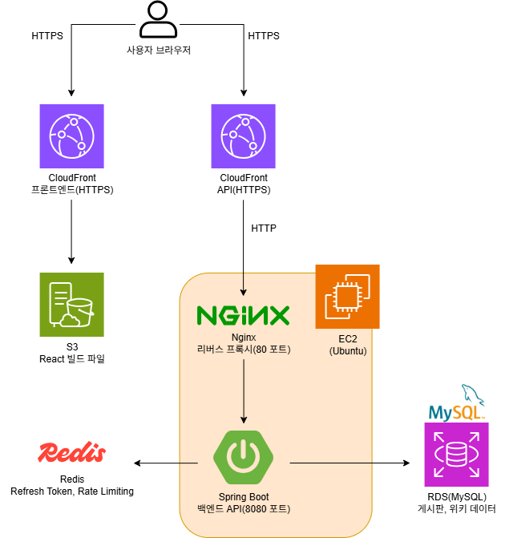

# Tangerine

> 리듬게임 beatmania IIDX의 수록곡, 작곡가, 게임 타이틀 정보를
> 사용자가 직접 작성하고 공유할 수 있는 위키 및 커뮤니티 서비스

개발자 양성 과정에서 Java + JSP 기반의 전통적인 MVC Model 2 방식으로
웹 개발을 학습 및 경험했으며, 이전 회사에서 전자정부프레임워크 기반의 프로젝트를 접하며
새로운 기술에 대한 필요성과 레거시 기술에 대한 한계를 동시에 느꼈습니다.
때문에 웹 개발 업계의 표준 기술 스택인 Spring Boot + React를 기반으로
JWT 인증, Redis, TypeScript, AWS 클라우드 배포 등을
직접 설계하고 구현해보기 위해 이 프로젝트를 시작했습니다.

---

## 배포 URL

| 구분 | URL |
|------|-----|
| 서비스 | https://dzhda13pro9ex.cloudfront.net |
| API 서버 | https://d2vmrs7ksqotm2.cloudfront.net |

---

## 기술 스택

**백엔드**
- Java 17, Spring Boot 4.x, Spring Security
- JWT (jjwt 0.12.6), JPA/Hibernate, MySQL 8.0
- Redis, Gradle

**프론트엔드**
- React, TypeScript, React Query (@tanstack/react-query)
- Axios, Tailwind CSS, React Router

**배포 환경**
- AWS EC2, RDS (MySQL), S3, CloudFront
- Nginx, Ubuntu 26.04

---

## 시스템 아키텍처



---

## 주요 기능

### 인증
- JWT Access Token(30분) + Refresh Token(7일) 기반 로그인
- Access Token 만료 시 자동 재발급 (axios 인터셉터)
- Redis 기반 Refresh Token 관리 및 로그아웃 처리
- 로그인 5회 실패 시 5분 차단 (Redis Rate Limiting)

### 권한 체계
- 4단계 권한 구조: USER / TRUSTED / MANAGER / ADMIN
- 공지사항 작성: MANAGER 이상만 가능
- 위키 템플릿 관리: ADMIN만 가능
- 관리자의 타인 게시글/댓글 강제 삭제 가능
- 관리자 페이지를 통한 사용자 등급 변경 UI 미구현 (개선 예정)

### 위키
- EAV 패턴 기반 동적 필드 설계
  (관리자가 필드를 자유롭게 추가/제거 가능, 테이블 구조 변경 없음)
- 문서 유형별 목록 조회 및 키워드 검색
- 문서 수정 이력 저장 (백엔드 한정, 사용자 조회 UI 미구현 - 개선 예정)

### 게시판
- 자유 게시판 / 공지사항 구분
- 게시글 및 댓글 CRUD (소프트 삭제)

---

## 기술적 의사결정

### Spring Boot
Java 기반 백엔드 프레임워크 중 국내 웹 개발 업계에서 가장 널리 사용되는 표준 기술입니다.
순수 Spring 대비 복잡한 설정을 자동으로 처리해주며 내장 Tomcat으로 별도 WAS 설정이
필요 없어 개발 생산성이 높습니다. 또, 이전 회사에서는 전자정부프레임워크 기반의 솔루션을
활용하는 작업이 주 업무였는데, 업무를 보며 최신 기술 스택으로의 전환 필요성을 체감하여
선택하게 되었습니다.

### JWT 인증
React와 Spring Boot가 완전히 분리된 구조에서 세션/쿠키 방식은 서로 다른 출처(포트)
간 통신 시 CORS 설정이 복잡해지는 문제가 있습니다. JWT는 Authorization 헤더로 전달해
이 문제에서 자유롭고, 서버가 직접 상태를 저장하지 않기 때문에 서버 확장에도 유리합니다.
다만 토큰 탈취 시 즉시 무효화가 어렵다는 단점이 있기 때문에 Access Token의 수명을
30분으로 짧게 설정하였으며, Refresh Token은 Redis에 저장해 보완하였습니다.

### Redis

#### Refresh Token 저장
MySQL은 디스크 기반이라 매 재발급마다 I/O가 발생하지만 Redis는 메모리 기반이라 빠르고
TTL 설정으로 7일 후 자동 삭제돼 별도의 만료 관리 코드가 필요하지 않습니다.

#### Rate Limiting
로그인 실패 횟수를 Redis 카운터로 추적하고 5회 초과 시 5분간 차단하도록 작업하였습니다.
TTL 설정으로 5분 후 카운터가 자동 삭제돼 별도의 만료 처리 코드가 필요하지 않습니다.

### EAV 패턴 (위키 필드 설계)
위키 문서의 필드는 문서 유형마다 다르기 때문에 관리자가 언제든 추가하거나 제거할 수
있어야 합니다. 일반 컬럼 방식의 경우 필드가 바뀔 때마다 ALTER 쿼리가 필요하고 유형마다
구성이 달라 NULL 컬럼이 많이 발생합니다. EAV 패턴을 활용하여 document_fields 테이블에
key-value 형태로 저장해 ALTER 쿼리 없이도 필드를 동적으로 관리할 수 있습니다. 다만,
특정 필드 기준 검색이 어렵고 JOIN이 복잡해질 수 있는 단점이 있는데, Tangerine의 경우
검색 기능을 제목 기준으로 구현하는 방식으로 문제를 보완하였습니다.

### TypeScript 도입
JavaScript는 동적 타입이기 때문에 타입 불일치 오류를 실행 시점에 도달해야 발견할 수
있습니다. TypeScript를 도입하면 오류를 컴파일 단계에서 잡아 주기 때문에 안정성이 높아지고,
백엔드 DTO와 1:1 대응되는 타입을 정의해 API 요청/응답 구조를 코드에서 명확히 표현할 수
있습니다. JavaScript로 작업한 프로젝트를 TypeScript 기반으로 전환하는 방식으로 작업하였는데,
기존 .jsx 파일 기반의 프로젝트를 한 번에 전부 바꾸면 오류가 대량 발생할 수 있기 때문에
allowJs: true 설정으로 .jsx와 .tsx를 동시에 사용할 수 있는 환경에서 전환 작업을 진행하였습니다.

### React Query 도입
기존 useState + useEffect 방식은 로딩/에러 상태를 매 컴포넌트마다 직접 관리해야 하고
경쟁 상태 방어 코드도 작성해야 했습니다. React Query를 도입하여 반복적인 코드를 제거하고
같은 queryKey의 데이터는 캐시에서 꺼내 중복 요청을 막을 수 있었습니다. 또, 데이터 수정 후
invalidateQueries로 관련 쿼리만 골라 새로고침할 수 있어 상태 관리를 단순화할 수 있었습니다.

---

## 트러블슈팅

### Spring Security 401/403 응답이 500 응답으로 바뀌는 문제

**문제 상황**
인증 실패(401)나 권한 부족(403) 상황에서 클라이언트가 500 응답을 받는 문제가 발생했습니다.

**원인**
Spring Security의 기본 동작인 sendError()가 /error로 forward를 발생시켜
Security 필터를 한 번 더 거치는 과정에서 응답 코드가 변경되는 것이 원인이었습니다.

**해결**
AuthenticationEntryPoint와 AccessDeniedHandler에서 sendError() 대신
HttpServletResponse에 직접 상태 코드와 메시지를 작성하는 방식으로 해결했습니다.

---

### 탭 간 로그인 상태 불일치 문제

**문제 상황**
한 탭에서 로그인하면 다른 탭에서 로그인 상태가 반영되지 않고, 새로고침해야만
동기화되는 문제가 발생했습니다.

**원인**
localStorage는 같은 출처의 모든 탭에서 공유되지만,
React의 메모리 state(AuthContext)는 탭마다 독립적으로 존재하기 때문입니다.
한 탭에서 로그인해 localStorage가 변경되더라도 다른 탭의 React state는 갱신되지 않았습니다.
또한 localStorage에 accessToken, userRole, userNickname을 각각 별도 키로 저장하던 방식에서
storage 이벤트가 각 키마다 순서대로 발생하기 때문에, accessToken 이벤트 시점에
userRole과 userNickname이 아직 저장되지 않아 null로 읽히는 타이밍 문제도 있었습니다.

**해결**
세 값을 "auth"라는 단일 키에 JSON으로 묶어 저장하는 방식으로 변경해
storage 이벤트가 한 번만 발생하도록 했습니다.
또한 window의 storage 이벤트를 리스닝해 다른 탭의 localStorage 변경을
감지했을 때 AuthContext state를 동기화하도록 구현했습니다.

---

### Mixed Content 에러로 인한 API 통신 차단 문제

**문제 상황**
CloudFront(HTTPS)로 배포된 프론트엔드에서 EC2의 Spring Boot API(HTTP)를
호출할 때 브라우저가 요청을 차단하는 문제가 발생했습니다.

**원인**
브라우저 보안 정책상 HTTPS 페이지에서 HTTP 요청을 보내는 Mixed Content는
차단됩니다. 도메인이 없어 EC2에 SSL 인증서를 직접 설치할 수 없었습니다.

**해결**
EC2 앞에 API 전용 CloudFront 배포를 추가로 구성했습니다.
CloudFront가 HTTPS를 담당하고 내부적으로 EC2의 Nginx(80포트)에 HTTP로 전달하는
구조로 변경해 브라우저 보안 정책을 준수하면서 통신할 수 있도록 했습니다.

---

## 프로젝트 구조

### 백엔드

```
src
├── main/java/com/tangerine/tangerine
│   ├── domain
│   │   ├── admin         # 관리자 기능 (템플릿 관리)
│   │   ├── board         # 게시글, 댓글
│   │   │   └── dto       # PostCreateRequest, PostResponse 외
│   │   ├── user          # 회원가입, 로그인, 토큰 재발급
│   │   │   └── dto       # LoginRequest, LoginResponse, SignupRequest
│   │   └── wiki          # 위키 문서, 템플릿, 수정 이력 (EAV 패턴)
│   │       └── dto       # DocumentCreateRequest, DocumentResponse 외
│   └── global
│       ├── config        # SecurityConfig, RedisConfig, JacksonConfig
│       ├── exception     # GlobalExceptionHandler
│       └── security      # JwtProvider, JwtAuthenticationFilter, RateLimitService
└── test/java/com/tangerine/tangerine
    └── domain
        ├── board         # PostServiceTest (게시글 작성, 수정, 삭제)
        ├── user          # UserServiceTest (회원가입, 로그인, 토큰 재발급)
        └── wiki          # DocumentServiceTest (문서 작성, 수정, 삭제)
```

### 프론트엔드

```
src
├── api               # axios 인스턴스, documentApi, postApi, adminApi
├── context           # AuthContext (로그인 상태 전역 관리)
├── hooks             # useDarkMode
├── types             # 백엔드 DTO와 1:1 대응 TypeScript 타입
├── components
│   ├── auth          # LoginForm, SignupForm
│   ├── board         # PostCard, CommentSection
│   │                 # PostListPage, PostDetailPage, PostCreatePage, PostEditPage
│   ├── wiki          # DocumentCard, DocumentFieldView, WikiSearch
│   ├── AdminRoute.tsx
│   ├── Layout.tsx    # 공통 레이아웃 (네비게이션, 다크모드)
│   └── ProtectedRoute.tsx
└── pages
    ├── admin         # AdminTemplatePage
    ├── wiki          # DocumentListPage, DocumentDetailPage, DocumentCreatePage, DocumentEditPage
    ├── HomePage.tsx
    ├── LoginPage.tsx
    ├── NotFoundPage.tsx
    └── SignupPage.tsx
```
